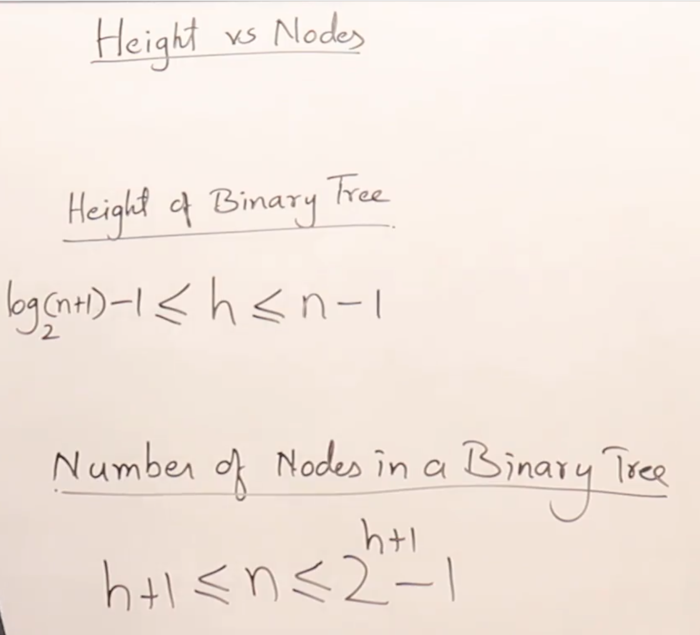

### element of programming

##### intro:
- [know how to impelment a list with dynamic allocation](https://essinstitute.in/exploring-dynamic-and-static-memory-allocation-in-python/)

- **helpful pdf** [cs.cum.edu lectures](https://www.cs.cmu.edu/afs/cs.cmu.edu/academic/class/15850-f20/www/notes/)
(Note: you can change the last part of the url to go to a specific lecture e.g lec11.pdf --> streaming algorithms)

- Apply patterns: **patterns**-general reusable solutions to commonly occurring problems-can
be a good way to approach a baffling problem. Examples include **finding a good data structure**,
seeing if your problem is a good fit for a general algorithmic technique, e.g., **divide-and-conquer**,
**recursion**, or **dynamic programming**, and **mapping** the problem to a **graph**.

- [Python collections](https://docs.python.org/3/library/collections.html) or in [intermediate python](https://book.pythontips.com/en/latest/collections.html)

#### chapter 1. Primitive Types

- The usage of `^` comes to the **parity**. `XOR` in python.
- The usage of **caching** in comutative and associative operations
- **remember the tricks of `x & (x - 1)` vs `x & ~(x - 1)`**
- trick for sorting a list of namedtuple based on a specific key:
```python
from operator import attrgetter
import collections

Point = collections.namedtuple('Point', ('x', 'y'))
lst = [P1, P2, P3, P4]
# sorting based on y
sorted_lst = sorted(lst, key=attrgetter('y'))
```
- Nice note to be aware of: `a - (a & b) + b = 11100111` [explanation](https://stackoverflow.com/questions/1604258/why-is-a-b-equivalent-to-a-a-b-b)

#### chapter 5. Arrays
###### books bootcamp on array notes:
  - when working with arrays, we should take advantage of the fact that we can operate efficiently on both ends. (for **two-pointers** solutions)

  - Array problems often have simple brute-force solutions that use O(n) *space*, but there are subtler solutions that use the array itself to reduce *space* complexity to O(1).

  - Filling an array from the front is slow, so see if it's possible to **write values from the back**

  - Instead of deleting an entry (which requires moving all entries to its left), consider **overwriting** it.

  - When dealing with integers encoded by an array consider processing the digits from the *back* of the array. Altemately, **reverse the array so the least-significant digit is the first entry**.

  - Be comfortable with writing code that operates on **subarrays**

  - Don't worry about preserving the integrity of the array (sortedness, keeping equal entries together, etc.) **until it is time to return**.

  - an array can serve as a good data structure when you know the distribution of the elements in advance. For example, a Boolean array of length W is a good choice for representing a subset
  of {0, 1, ... ,W - 1}. (When using a Boolean array to represent a subset of {1, 2, ..., n} allocate anarray of size n+1 to simplify indexing.)
  
  - when operating on 2D arrays, use **parallel logic** for rows and for columns

- The difference between **shallow** and **deep** copying is only relevant for compound objects (objects that contain other objects, like lists or class instances):
  - A shallow copy constructs a new compound object and then (to the extent possible) inserts *references* into it to the objects found in the original.
  - A deep copy constructs a new compound object and then, recursively, inserts copies into it of the objects found in the original.

- Key methods for list include min(A), max(A), binary search for sorted lists
(bisect.bisect(A,6), bisect.bisect_left(A,6), and bisect.bisect_right(A,6)),
A.reverseO (in-place), reversed(A) (retums an iterator), A.sort()(in-place), sorted(A)
(returns a copy), del A[i] (deletes the i-th element), and del A[i: j] (removes the slice).

- [bisect] module: This module provides support for maintaining a list in *sorted* order without having to sort the list after each *insertion*. For long lists of items with expensive comparison operations, this can be an improvement over linear searches or frequent resorting. The module is called bisect because it uses a basic bisection algorithm to do its work. Unlike other bisection tools that search for a specific value, the functions in this module are designed to **locate an insertion point**.

- cool thing that can be done using slicing:
```python
l = [1, 2, 3, 4, 5, 6]
l[:-1] # removes the last element
l[k:] + l[:k] # rotate l by k to the left
l[::-1] # reverse
l2 = l[:] # shallow copy
```

- **partitioning strategy** based on a sepecific pivot.

- getting the count of every distinct value in the list:
```python
from collections import Counter
l = # some list
c_m = Counter(l)
```

- cool stuff with binary and being variable length:
```python
m = "100110101"
n = m.zfill(15) # changin m to be 15 length size, filling the leading zeros.
# or
n2 = '{:015b}'.format(11) # changing an integer to be in a specific length.
```

- the ith entry in nth row, in pascal triangle is the P(n, r). in fact we can use the pascal triangle to compute P(n ,r)

- note the ~ operator which is the corresponding index in an array from the left.

- `result = [[1] * n for i in range(n)]` is correct. `n * [[1] * n]` is a trap.

#### chapter 6. String

- important concepts about strings which differentiate them from arrays: comparison, joining, splitting, searching for substrings, replacing one string by another, parsing

- advanced string processing algorithms often use hash tables and dynamic programming

- strings are immutable, so concatenating a string into another string implies creating new one and then changing the original one with the new one

- alternative to immutable strings --> e.g `list` in python

- updating a mutable strings from the front is slow, so consider approach to do so and **write the values from the back**

- 
```python
chr(ord('0') + some_int) # convert some_int to the corresponding string of that int
```

- [functools.reduce vs itertools.accumulate](https://realpython.com/python-reduce-function/)

- The idea behind Python’s `reduce()` is to take an existing function, apply it cumulatively to all the items in an iterable, and generate a single final value. In general, Python’s reduce() is handy for processing iterables without writing explicit for loops. Python’s reduce() also accepts a third and optional argument called `initializer` that provides a **seed** value to the computation or reduction.

- **CStyle arrays** -contiguous preallocated blocks of memory. how can we create on?
```python
import ctypes
array_type = ctypes.py_objects * 3 # define the size of the array.
array = array_type() # creating an array of size 3 which is NULL at first
# now we have an array of size 3 which is NULL.
```

- just a self implemented Array which has room for further insertions:
```python
import ctypes
from typing import List

class Array:
    def __init__(self, arr: List, size):
        array_data_type = ctypes.py_object * size
        self.size = size
        self.arr = arr
        self.memory = array_data_type()
        self.index = 0

        for i, ele in enumerate(self.arr):
            self.memory[i] = ele

    def __iter__(self):
        return self
    
    def __next__(self):
        if self.index >= len(self.arr) and self.index < self.size:
            return None
        elif self.index >= self.size:
            raise StopIteration
        value = self.arr[self.index]
        self.index += 1
        return value
    
    # indexing into array
    def __getitem__(self, idx):
        return self.memory[idx]
    
    # changing values by their index
    def __setitem__(self, idx, val):
        self.memory[idx] = val

    # size returns the size of the array   
    def size(self):
        return self.size
    
    # length returns the length of the populated chunks of array
    def length(self):
        return len(self.arr)
```

- it's good to have a grasp on `functools.reduce` source function:
```python
def reduce(function, iterable, initializer=None):
    it = iter(iterable)
    if initializer is None:
        value = next(it)
    else:
        value = initializer
    for element in it:
        value = function(value, element)
    return value
```
- `x.isalnum()` used to detect alphanumeric characters.

- difference between `find()` and `index()`:
```python
s = "some test string"
s.find('-1 if not found') # returns the index, but return -1 if not found
s.index('ValueError if not found') # returns the index, but raises ValueError if not found
```

- `__contains__` magic method.
```python
l = ["amir", "loves", "fasting"]
for ele in l:
    if ele.__contains__("fast"):
        print("fast is present")
```

- `itertools.product` can save us from nested loops:
```python
class product(builtins.object)
  product(*iterables, repeat=1)
```
- Cartesian product of input iterables.  Equivalent to nested for-loops.
For example, product(A, B) returns the same as:  ((x,y) for x in A for y in B).

```python 
'''
  The leftmost iterators are in the outermost for-loop, so the output tuples
  cycle in a manner similar to an odometer (with the rightmost element changing
  on every iteration).

  To compute the product of an iterable with itself, specify the number
  of repetitions with the optional repeat keyword argument. For example,
  product(A, repeat=4) means the same as product(A, A, A, A).

  product('ab', range(3)) --> ('a',0) ('a',1) ('a',2) ('b',0) ('b',1) ('b',2)
  product((0,1), (0,1), (0,1)) --> (0,0,0) (0,0,1) (0,1,0) (0,1,1) (1,0,0) ...

  Methods defined here:
  '''

  __getattribute__(self, name, /)
      Return getattr(self, name).
 
  __iter__(self, /)
      Implement iter(self).

  __next__(self, /)
      Implement next(self).

  __reduce__(self, /)
      Return state information for pickling.

  __setstate__(self, object, /)
      Set state information for unpickling.

  __sizeof__(self, /)
      Returns size in memory, in bytes
```

- another cool usage of `itertools` package.
```python
import itertools

itertools.product(*("some generator that can be unpacked for the cartesian product"))
# product(range(2), repeat=3) -> 000 001 010 011 100 101 110 111
```

- the power of `itertools`. [../String/look_and_say.py](source algo)
```python
import itertools
s = '1'

for _ in range(n):
    s = ''.join(
        str(len(list(group))) + key for key, group in itertools.groupby(s)
    )
```

- consider the usage of `collections.OrderedDict` when the traversal and order is important in a dictionary.
```python
# as an example
roman = OrderedDict()
    roman[1000] = "M"
    roman[900] = "CM"
    roman[500] = "D"
    roman[400] = "CD"
    roman[100] = "C"
    roman[90] = "XC"
    roman[50] = "L"
    roman[40] = "XL"
    roman[10] = "X"
    roman[9] = "IX"
    roman[5] = "V"
    roman[4] = "IV"
    roman[1] = "I"
```

- notice the usage of `itertools.product` instead of nested for loops, here the exact source from [python docs](https://docs.python.org/3/library/itertools.html#itertools.product)
```python
def product(*iterables, repeat=1):
    # product('ABCD', 'xy') → Ax Ay Bx By Cx Cy Dx Dy
    # product(range(2), repeat=3) → 000 001 010 011 100 101 110 111

    if repeat < 0:
        raise ValueError('repeat argument cannot be negative')
    pools = [tuple(pool) for pool in iterables] * repeat

    result = [[]]
    for pool in pools:
        result = [x+[y] for x in result for y in pool]

    for prod in result:
        yield tuple(prod)
```


#### chapter 7. Linked Lists

- consider using a **dummy head** (sometimes refered to as sentinel) to avoid having to check for empty lists. this simplifies code and makes bugs less likely.

- algorithms operating on singly linked list often benefit from **two iterators**, one ahead of the other or one advancing quicker than the other.

- In Python, there’s a specific object in the *collections* module that you can use for linked lists called `deque` (pronounced “deck”), which stands for **double-ended queue**. `collections.deque` uses an implementation of a linked list in which you can access, insert, or remove elements from the beginning or end of a list with constant O(1) performance.

- consider using `appendleft()` and `popleft()` on a deque object to append and pop to the head of the queue.

- `collections.deque` uses a linked list as part of its data structure. With doubly linked lists, deque is capable of inserting or deleting elements from both ends of a queue with constant O(1) performance.

- reverse a linkedlist: here you are...
```python
def reverse(head):
    dummy = ListNode(0)
    while head:
        dummy.next, head.next, head = head, dummy.next, head.next
    return dummy.next
```
so for reversing a sublist of a list:
```python
sublist_iter = sublist_head.next
for _ in range(finish - start):
    temp = sublist_iter.next
    sublist_iter.next, temp.next, sublist_head.next = (temp.next,
                                                        sublist_head.next,
                                                        temp)
```

#### chapter 8. Stacks and Queues

- learn to recognize where the stack **LIFO** property is applicable, for example *parsing* typically benefits from a stack.

- some problems require to implement our own stack class, but for others use the built-in `list` type

- when called on an empty list, both `l[-1]` and `l.pop()` raise and `IndexError` exception.

- in Queues, an insertion to the front is commonly called a *push*, and an insetion to the back is commonly called as *inject*. a deletion from the front is commonly called a *pop* and a deletion from the back is commonly called *eject*.
- learn where the FIFO can be applicable, for example, queues are ideal when the *order* need to be preserved.

#### chapter 9. Binary Trees

- _height_ of a tree at each depth are the number of edges from root to that node, and the _level_ is the number of nodes from root to that node. the _depth_ of a node n is the number of nodes on the _search path_ from the root to the n not including the n itself.
- at unlabeled nodes type of trees: the number of Trees for a given number of nodes is calculated from this formula --> `(2*n C5) / n + 1` (Catalan Number formula)
- at unlabeled nodes type of trees: for any number of nodes we have `2 ^ n - 1` trees with max-height
- 

- in binary tree this formula is always True -> number of nodes with `deg(0)` = number of nodes with `deg(2)` (the relationship between internal nodes and external nodes)
- in strict binary tree this formula is always True -> `e = i + 1` (external and internal nodes)
- formally a binary tree, is a either empty, or a _root_ node `r` together with a left binary tree and a right binary tree.
- at a high level, binary trees are commonly applicable when dealing with hierarchies.
- the number of non-leaf nodes in a _full binary tree_ is one less than the number of leaves
- a perfect binary tree of height _h_ contains exactly `2^(h+1) -1` nodes of which `2^h` are leaves.
- there are different kinds of traversing a binary tree --> _inorder_ , _preorder_, _postorder_
- a complete binary tree of height `h` is a full binary tree of height `h - 1` which in the last height elements are filled from left to right without skipping any element
- we need complete binary trees, to be suitable for arrays, so we don't have any blanked spaces in between. (remember stacks and queues)
- the actual representation of Tree traversal:
    - *Preorder* -> visit(node), Preorder(left), Preorder(right)
    - *Inorder* -> Inorder(left), visit(node), Inorder(right)
    - *Postorder* -> Postorder(left), Postorder(right), visit(node)

- to generate a tree with linked representation we get the help of **Queue**.
- the function call stack in traversing a binary tree is `h + 2` and the call to the function on the recursive implementation of each one of them is `2n+1` --> `O(n)`
- in level by level traversal, we use *Queue* and push the address of the nodes into it. when we hit `NULL` we pop from the queue and make the pointer point to that address then continue
- to generate a tree with traversal we need Inorder --> cause inorder help us decide the nodes to split the nodes, cause it is in order. the root is defined in the middle.
- consider using the **monotonic decreasing stack** in an array of integers to construct the max-tree of the array.
- if the recursion function is a tail recursion (means that the recursive call is at the end of the function), to convert it to iteratvie function, we don't need stack.
- after deleting a node in a binary search tree, the *inorder predecessor* or the *inorder successor* will take it's place(rightmost child of the left subtree or leftmost child of the right subtree)
- we can reconstruct a binary search tree from just a preorder using a stack.
- the drawback of a binary search tree is that there is not control on the height of the tree, and it all depends on the insertion order.
- comparison between **DFS** and **BFS**:

###### AVL Trees. (height-balanced binary search trees)

- rotations are always performed on _three_ nodes only.

- **BFS** : 
    - BFS is a graph traversal algorithm that explores all neighboring nodes at the *present* depth before moving on to nodes at the next depth level.
    - It is implemented using a **queue** (FIFO structure) and is useful for:
      - Finding the shortest path in an unweighted graph.
      - Level-order traversal of trees.
      - Connected component detection in graphs.

#### Chapter 10. Heaps

- heaps are defined as a complete binary tree.
- heaps are sometimes referred to as *priority queues*, because it somehow behaves like a queue, with a little difference with is any key,
has a priority associated to it, and that key as at the index `0`, and we pop it.
- sorting heap aka heap sort: `sorted_items = [heapq.heappop(heap) for _ in range(len(heap))]`
- a *min-heap* is ideal for maintaining a collection of elements when we need to add arbitrary values and extract the smallest element.
- consider using `itertools.groupby()` when is needed.
```python
from itertools import groupby

# the input array is increasing up to certain index and then decreasing
# this pattern is repeated for k times
# we want to store each increasing and decreasing array separately.
def list_k_increasing_decreasing_array.py(A):
    class Monotonic:
        def __init__(self):
            self._last = float('-inf') # the first seq is increasing order

        def __call__(self, curr):
            res = curr < self._last
            self._last = curr
            return res

    return [list(group)[::-1 if is_decreasing else 1] for is_decreasing, group in itertools.groupby(A, Monotonic())]
```
- in the above code, we've defined a Monotonic class to use it as a key function to our `groupby` method. when it is called, it checks the curr element with the last seen element, and if it is smaller, it determines that we are in decreasing order otherwise we are in increasing order and based on this feature, we are grouping our list into monotonic list of lists.

#### chapter 11. Searching

- **search algorithms** can be classified in a number of ways. Is the underlying collection static or dynamic? i.e, insert and deletes are interleaved with searching? Is it worth spending the computational cost to preprocess the data so as to speed up subsequent queries? Are there statistical properties of the data that can be exploited? Should we operate directly on the data or transform it?

- binary search are applicable not just for searching in a sorted array, but also is used to search an **interval of real numbers or integer**
- if the solution uses sorting and the computation after the sorting is faster than sorting e.g O(n) or O(log n), look for a solution that **do not perform a complete sort**.

- the fundamental idea of using binary search is to **maintain a set of candidate** results.

- 